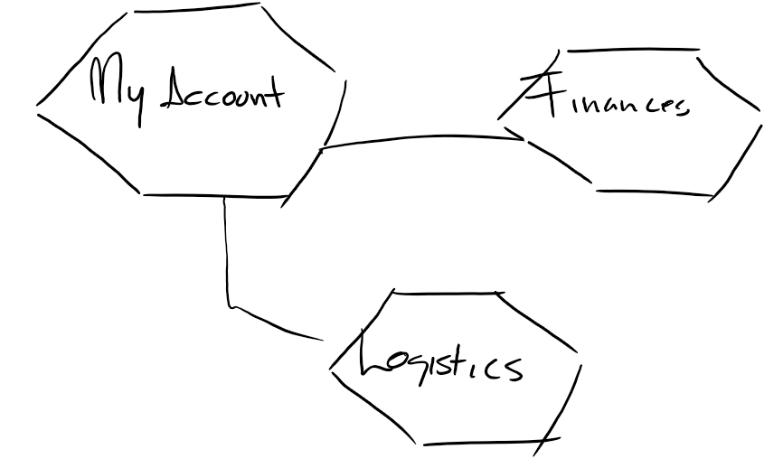
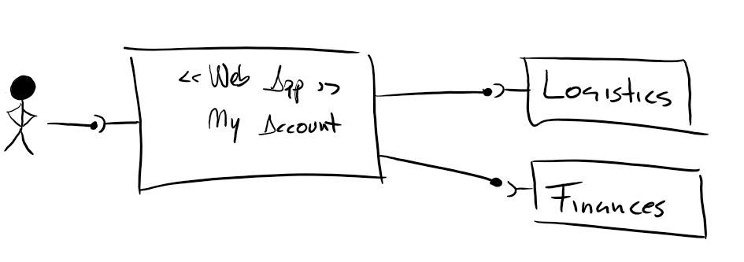
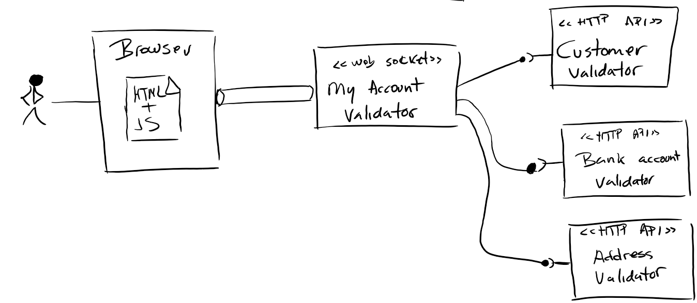

Validation Responsability
=========================

Description
-----------

This project is a proof (*PoC*) of concept about having a user interface (*UI*) in which the user can interact with data that have different business ownership (belongs to different business domains/context).

In this scenarios the UI usually have user data input validation. 

> TK

### Context

In this PoC we have three domains:

  - **Customer care**: This domain is owner of customer data.
  - **Finances**: This domain is responsable of financial information and formats, as bank acocunt valid formats, etc.
  - **Logistics**: The owner of all logistics related information, as delivery adresses, address formats, etc.

> **Note**: this image should the replaced with one with **Customer Care** instead of *My Account*. My account is an application not a functional domain.

### Microservices

### Subsystems

Modules/Microservices
---------------------

  - My Account
  - Finances
  - Logistics

Run
---

In each sub-project (finances, logistics and myaccount):

  $ mvn clean package exec:java

To access the application:
 
  http://localhost:8080
